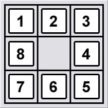

# Artificial Intelligence-Game Strategy
### This project is trying to develop an AI for 3 games


### 1. Four-in-a-line [(Code)](https://github.com/Hank-Tsou/Artificial-Intelligence-four-in-a-line)
```
Algorithm: Minimax algorithm with alpha-beta pruning
```


### 2. N-queen [(Code)](https://github.com/Hank-Tsou/Artificial-Intelligence-N-queen)
```
Algorithm: (1) Genetic Algorithm (2) Simulate Annealing Algorithm
```


### 3. 8-puzzle [(Code)](https://github.com/Hank-Tsou/Artificial-Intelligence-8-puzzle)
```
Algorithm: 'A' star Algorithm with 2 different heuristic function
  * h1: (the number of misplace tiles)
  * h2: (Manhattan Distance)
```




## Code
* [Four-in-a-line](https://github.com/Hank-Tsou/Artificial-Intelligence-four-in-a-line)
* [N-queen](https://github.com/Hank-Tsou/Artificial-Intelligence-N-queen)
* [8-puzzle](https://github.com/Hank-Tsou/Artificial-Intelligence-8-puzzle)

## License

This project is licensed under the MIT License - see the [LICENSE.md](LICENSE.md) file for details

## Acknowledgments

* Author: Hank Tsou
* Contact: hank630280888@gmail.com
